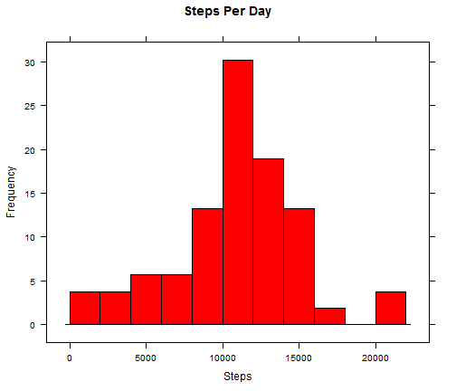
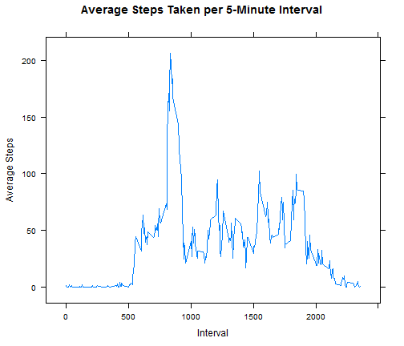
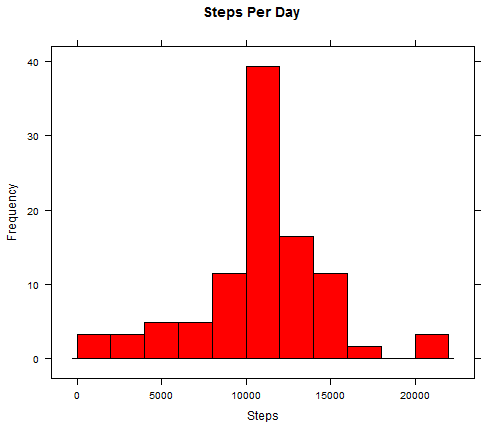
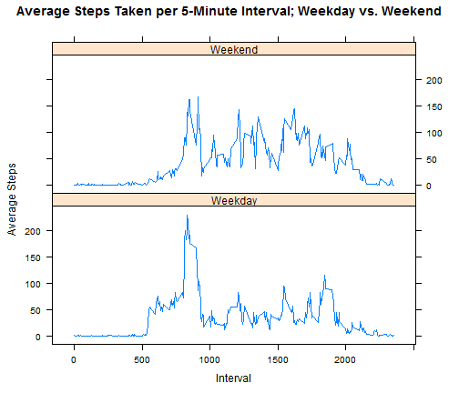

# Reproducible Research: Peer Assessment 1


## Loading and preprocessing the data

Load the data (i.e. `read.csv()`)

```r
  ## Unzip activity file.
  zipFilename <- "activity.zip"
  zipPath <- file.path(zipFilename)
  activityFile <- unzip(zipPath)
  
  ## Read in data file, retain 'NA' values
  activityRaw <- read.csv(activityFile)
```

Process/transform the data (if necessary) into a format suitable for your analysis

```r
  ## Create dataset without 'NA' values.
  activityRemoveNA <- na.omit(activityRaw)
  
  ## Transform data into table of total number of steps per day.
  activityDay <- aggregate(activityRemoveNA$steps,by=list(activityRemoveNA$date),sum)
  colnames(activityDay) <- c('date','totalSteps')
  activityDay$date <- as.Date(activityDay$date)
```
## What is mean total number of steps taken per day?

Make a histogram of the total number of steps taken each day



Calculate and report the **mean** and **median** total number of steps taken per day

a) **Mean** total number of steps taken per day.

```
## [1] 10766
```

b) **Median** total number of steps taken per day.

```
## [1] 10765
```

## What is the average daily activity pattern?

Make a time series plot (i.e. `type = "l"`) of the 5-minute interval (x-axis) and the average number of steps taken, averaged across all days (y-axis)



2. Which 5-minute interval, on average across all the days in the dataset, contains the maximum number of steps?

```
##     interval averageSteps
## 206     1705         56.3
```

## Imputing missing values

Note that there are a number of days/intervals where there are missing
values (coded as `NA`). The presence of missing days may introduce
bias into some calculations or summaries of the data.

Calculate and report the total number of missing values in the dataset (i.e. the total number of rows with `NA`s)

```
## [1] 2304
```

Devise a strategy for filling in all of the missing values in the dataset. The strategy does not need to be sophisticated. For example, you could use the mean/median for that day, or the mean for that 5-minute interval, etc.

```r
# Merge the raw activity data (with NAs) and average steps per interval data frames.
activityMerge <- merge(activityRaw, activityInterval)
  
# Order merge data by date, and then interval.
activityMerge <- activityMerge[order(activityMerge$date,activityMerge$interval),]
  
# replace NA values with the corresponding average steps per interval.
activityMerge$steps[is.na(activityMerge$steps)] <- activityMerge$averageSteps[is.na(activityMerge$steps)]
```

Create a new dataset that is equal to the original dataset but with the missing data filled in.

```r
activityImputed <- subset(activityMerge, select = c("steps","date", "interval") )
activityImputed$steps <- round(activityImputed$steps,0)
```

Make a histogram of the total number of steps taken each day and Calculate and report the **mean** and **median** total number of steps taken per day. Do these values differ from the estimates from the first part of the assignment? What is the impact of imputing missing data on the estimates of the total daily number of steps?


**Mean** total number of steps taken per day.

```
## [1] 10766
```
**Median** total number of steps taken per day.

```
## [1] 10762
```

## Are there differences in activity patterns between weekdays and weekends?

Use the dataset with the filled-in missing values for this part.

Create a new factor variable in the dataset with two levels -- "weekday" and "weekend" indicating whether a given date is a weekday or weekend day.

```r
activityImputed$day <- factor(ifelse(as.POSIXlt(activityImputed$date)$wday %% 6 == 0, "Weekend", "Weekday"))
```
Make a panel plot containing a time series plot (i.e. `type = "l"`) of the 5-minute interval (x-axis) and the average number of steps taken, averaged across all weekday days or weekend days (y-axis).


